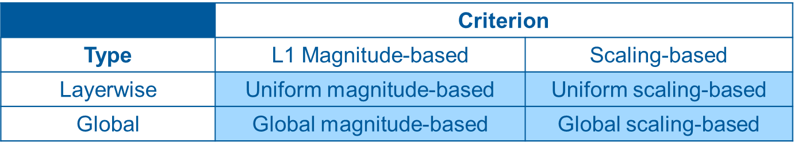

# Model Compression
Repository for model compression project using pruning and knowledge distillation methods.
- Pruning methods:
<p align="center">
    
</p>

- Fine-Tuning methods: `Retraining`, `Iterative Pruning`, `Knowledge Distillation` 
## Setup

1. Download the ImageNet 2012 dataset from [here](https://image-net.org/challenges/LSVRC/2012/2012-downloads.php) and place the files `ILSVRC2012_devkit_t12.tar.gz` and `ILSVRC2012_img_train.tar` or `ILSVRC2012_img_val.tar` based on data split (train, val, test) in the data root directory `data/imagenet`.
2. Visualization of model exploration in `notebooks/model_exploration.ipynb`
3. Run training using `train.py`
4. Evaluate models using `test.py`
5. Visualization of model evaluation in `notebooks/evaluation.ipynb`

## Folder Structure

``` bash
.
├── data/                       # ImageNet data, hyperparameter .yaml
├── models/                     # model architecture & pruning 
├── notebooks/                  # Exploration & eval notebook
├── runs/                       # Experiment results
├── scripts/                    # Example of sh scripts to run training & test
├── utils/                      # Utility functions
├── train.py                    # Training script
└── test.py                     # Eval script
```

### Citations
[`TinyML and Efficient Deep Learning Computing`](https://efficientml.ai/)

```bash
@software{torchvision2016,
    title        = {TorchVision: PyTorchs Computer Vision library},
    author       = {TorchVision maintainers and contributors},
    year         = 2016,
    journal      = {GitHub repository},
    publisher    = {GitHub},
    howpublished = {\url{https://github.com/pytorch/vision}}
}
